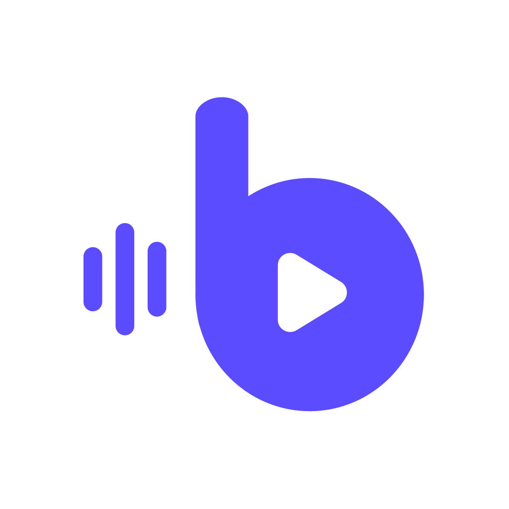

<div align="center">
  

  <h1>Buddio</h1>
  <p><em>By Hugo Rios</em></p>

  <p><strong>Your sounds. Any shortcut. Any call.</strong></p>
  <p>An offline-first soundboard for your desktop: import a clip, bind a hotkey,<br/>
  and fire it instantly in games, Discord, streams, or any app in focus.</p>

  <p>
    
    
    
    
    
  </p>

  <p>
    🇬🇧 English&nbsp;&nbsp;·&nbsp;&nbsp;🇧🇷 <a href="./README.pt-BR.md">Português</a>
  </p>
</div>

<br/>

<p align="center">
  
  
</p>

## What is Buddio?

Ever wished you could drop an air horn into a Discord call, cue a laugh track
mid-stream, or fire off a "gg" clip without tabbing out of your game? That's
Buddio in one sentence: your sounds, one keypress away, from anywhere on your
desktop.

No sign-up, no cloud, no subscription. You import a sound, give it a shortcut,
and it's yours forever, sitting quietly on your machine until you need it. Press
the key and it plays instantly: no loading spinner, no "just a sec."

## ✨ Why you'll like it

- 🎧 **Drop in and go**: drag and drop WAV, MP3, FLAC, OGG, or M4A files, or point Buddio at a folder to watch automatically
- ⌨️ **Global hotkeys**: trigger sounds even while a game or a call has focus
- 🔊 **Two outputs at once**: hear it yourself *and* send it straight into your mic or call output (works great with VB-CABLE)
- ⚡ **Instant playback**: clips are pre-loaded in memory, so there's zero lag between the key press and the sound
- 🗂️ **Collections & search**: sort sounds into "Streaming," "Gaming," "Calls"... and find any of them with `Ctrl/Cmd + K`
- 🎚️ **Built-in audio editor**: trim, fade, adjust gain, and loop, all without touching the original file
- 👤 **Profiles**: swap devices, volumes, and your go-to collection in a single click
- 🧭 **Routing you can actually see**: a live diagram shows exactly where your audio is going, with a one-click fix when it isn't
- 🪟 **Buddio Mini**: a cozy tray popover for firing your pinned sounds without opening the full window, plus an Ultra Compact mode for four favorites
- 🚀 **Guided setup**: a friendly first-run wizard walks you through output, mic, routing, your first sound, and your first hotkey
- 🌓 **Light & dark themes** that feel genuinely designed, not just inverted
- 🔒 **Private by default**: your library lives in a local file; audio never leaves your computer

## 📸 See it in action

<details open>
<summary><strong>Library, Routing & Profiles</strong></summary>
<br/>

<p align="center">
  
  
  
</p>

</details>

## 🧭 Status

Buddio 1.0 is stable on Windows, built and used day to day by its own author.
The core soundboard, hotkeys, routing, profiles, and Buddio Mini already work.
Windows ships with an NSIS installer (`.exe`) that also installs
[VB-CABLE](https://vb-cable.com) when needed and removes it on uninstall only
if Buddio installed it. SmartScreen may warn until the binary is code-signed —
see [`docs/release.md`](docs/release.md). macOS and Linux support is on the
roadmap; Windows is home base for now.

### Download / build the installer

```bash
bun install
bun run fetch:vbcable   # official VB-Audio pack (donationware)
bun run tauri build     # → target/release/bundle/nsis/Buddio_*_x64-setup.exe
```

Or push a `v*` tag — `.github/workflows/release.yml` builds the same setup.exe.

## 🤝 Contributing & running from source

Want to poke around, fix something, or just run Buddio yourself? Welcome
aboard, this is where the technical bits live.

<details>
<summary><strong>Quick start</strong></summary>
<br/>

You'll need [Bun](https://bun.sh) and [Rust](https://rustup.rs) installed. On
Windows, you'll also need the
[Visual Studio Build Tools](https://visualstudio.microsoft.com/visual-cpp-build-tools/)
with the **Desktop development with C++** workload (for MSVC + WebView2).

```bash
git clone https://github.com/hugoriosbrito/Buddio.git
cd buddio
bun install
bun run tauri dev
```

That's it: Buddio opens in dev mode. Import a sound, hit `Ctrl/Cmd + I`, set a
hotkey, and try it out.

</details>

<details>
<summary><strong>Low on disk space on <code>C:</code>?</strong></summary>
<br/>

```powershell
$env:CARGO_HOME = "D:\cargo-home"
$env:CARGO_TARGET_DIR = "D:\path\to\Buddio\target"
$env:TEMP = "D:\Temp"
$env:TMP = "D:\Temp"
```

Local linker overrides can live in `.cargo/config.toml` (gitignored).

</details>

<details>
<summary><strong>Building a release binary</strong></summary>
<br/>

```bash
bun run tauri build
```

</details>

<details>
<summary><strong>How it's built</strong></summary>
<br/>

| Layer    | Technology                                     |
| -------- | ----------------------------------------------- |
| Shell    | [Tauri 2](https://tauri.app) + Rust              |
| Frontend | React 19 + TypeScript + Vite + Tailwind CSS v4    |
| State    | Zustand                                          |
| Audio    | `rodio` / `symphonia` (`crates/audio-engine`)     |
| Storage  | SQLite via `rusqlite` (bundled, no server)        |
| Tooling  | [Bun](https://bun.sh)                            |

```text
src/                        # React UI
src-tauri/                  # Tauri app, managers, and commands
  resources/samples/        # Bundled audio test sample (sound-test-sample.wav)
crates/audio-engine/        # Playback engine (Tauri-independent, unit-testable)
docs/architecture/          # How the pieces fit together
docs/design/                # Design system, UX spec, and Figma reference exports
```

Curious how the audio engine keeps playback glitch-free? Read
[`docs/architecture/overview.md`](docs/architecture/overview.md). Want the
full design language and UX rules? See
[`docs/design/Buddio_Design_System_UX.md`](docs/design/Buddio_Design_System_UX.md).

</details>

Issues, ideas, and pull requests are all welcome. See
[`CONTRIBUTING.md`](./CONTRIBUTING.md) for commit conventions and the PR
checklist.

## 📄 License

Buddio is [MIT licensed](./LICENSE).

<div align="center">
<sub>Built with Tauri, Rust, and React. No account, no cloud, no telemetry.</sub>
</div>
