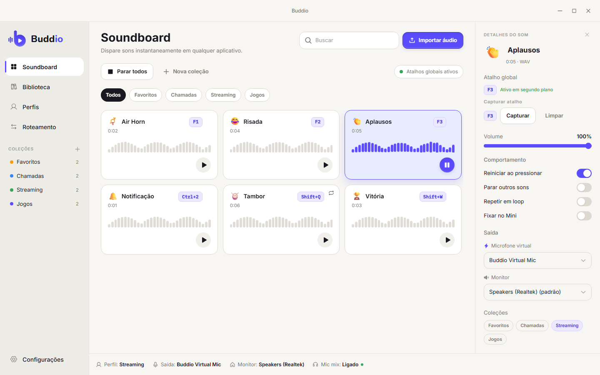
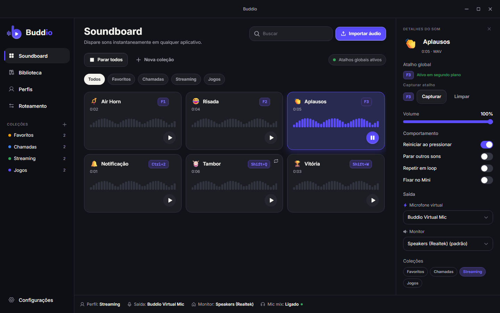
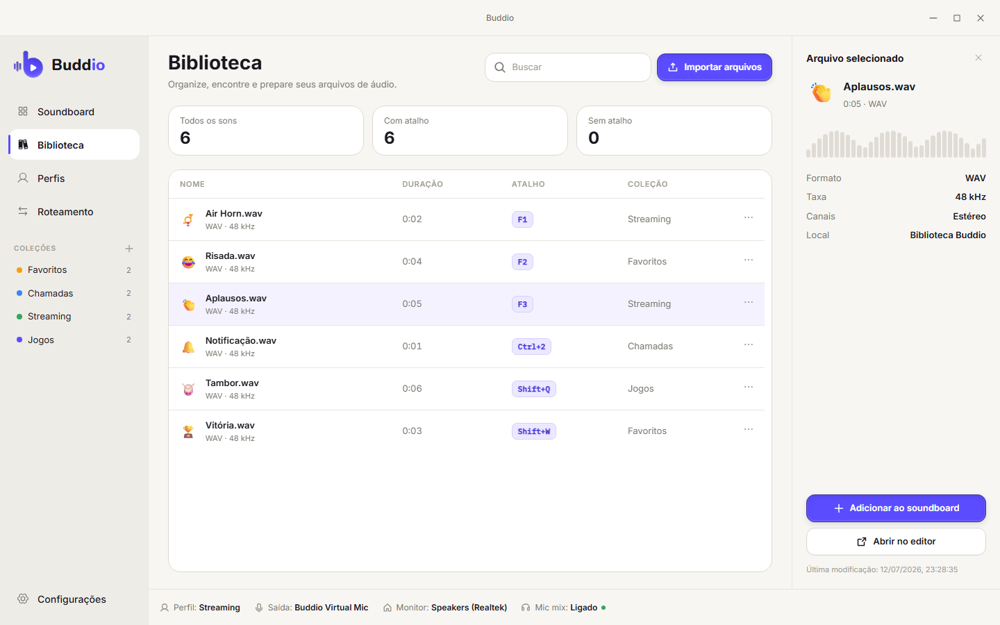
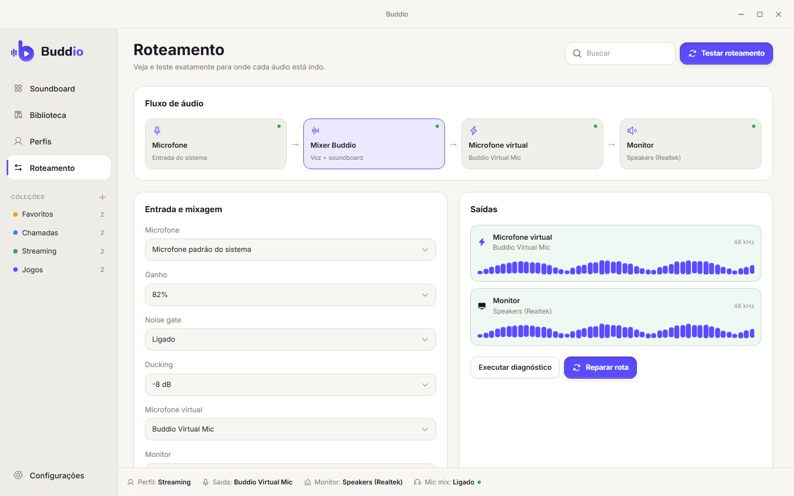
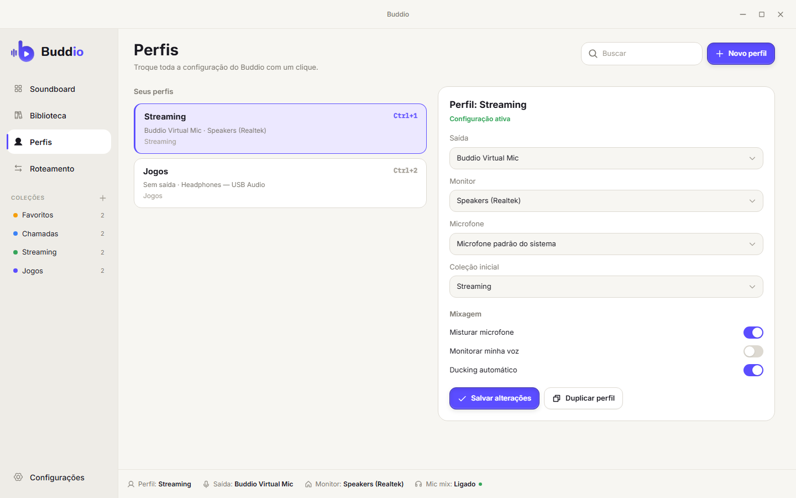

<div align="center">
  

  <h1>Buddio</h1>

  <p><strong>Seus sons. Qualquer atalho. Qualquer chamada.</strong></p>
  <p>Um soundboard offline-first para o seu desktop: importe um som, associe um atalho<br/>
  e dispare-o na hora, em jogos, no Discord, em transmissões ou em qualquer app em foco.</p>

  <p>
    
    
    
    
    
  </p>

  <p>
    🇬🇧 <a href="./README.md">English</a>&nbsp;&nbsp;·&nbsp;&nbsp;🇧🇷 Português
  </p>
</div>

<br/>

<p align="center">
  
  
</p>

## O que é o Buddio?

Já quis soltar uma buzina no meio de uma call do Discord, engatar uma risada
gravada na sua live ou mandar um "gg" sem precisar sair do jogo? É exatamente
isso que o Buddio faz, resumido numa frase: seus sons, a um toque de distância,
em qualquer lugar do seu desktop.

Sem cadastro, sem nuvem, sem assinatura. Você importa um som, dá um atalho pra
ele, e ele é seu pra sempre, guardadinho no seu computador até você precisar.
Aperta a tecla e toca na hora: sem rodinha de carregamento, sem "só um
segundo".

## ✨ Por que você vai gostar

- 🎧 **Arraste e já era**: solte arquivos WAV, MP3, FLAC, OGG ou M4A, ou aponte o Buddio pra uma pasta e deixe ele monitorar sozinho
- ⌨️ **Atalhos globais**: dispare sons mesmo com um jogo ou uma chamada em foco
- 🔊 **Duas saídas ao mesmo tempo**: ouça você mesmo *e* mande o som direto pro microfone ou chamada (funciona muito bem com VB-CABLE)
- ⚡ **Reprodução instantânea**: os clipes ficam pré-carregados em memória, então não existe atraso entre apertar o atalho e o som sair
- 🗂️ **Coleções e busca**: organize os sons em "Streaming", "Jogos", "Chamadas"... e encontre qualquer um com `Ctrl/Cmd + K`
- 🎚️ **Editor de áudio embutido**: corte, aplique fade, ajuste o ganho e configure loop, tudo sem alterar o arquivo original
- 👤 **Perfis**: troque dispositivos, volumes e a coleção favorita em um único clique
- 🧭 **Roteamento que você realmente enxerga**: um diagrama ao vivo mostra exatamente pra onde seu áudio está indo, com correção em um clique quando algo falha
- 🪟 **Buddio Mini**: um painel aconchegante na bandeja do sistema pra disparar seus sons fixados sem abrir a janela completa, com um modo Ultra Compact pra quatro favoritos
- 🚀 **Configuração guiada**: um assistente simpático no primeiro uso te leva por saída, microfone, roteamento, primeiro som e primeiro atalho
- 🌓 **Temas claro e escuro** que parecem de verdade desenhados, não só invertidos
- 🔒 **Privado por padrão**: sua biblioteca vive num arquivo local; o áudio nunca sai do seu computador

## 📸 Veja funcionando

<details open>
<summary><strong>Biblioteca, Roteamento e Perfis</strong></summary>
<br/>

<p align="center">
  
  
  
</p>

</details>

## 🧭 Status

O Buddio é um projeto jovem, construído e usado no dia a dia pelo próprio
autor. O soundboard principal, os atalhos, o roteamento, os perfis e o Buddio
Mini já funcionam. Ainda não existe um instalador pra baixar, então testar
hoje significa compilar a partir do código-fonte, o que leva só alguns
minutos. Veja a seção de
[Contribuição](#-contribuindo--rodando-a-partir-do-código-fonte) logo abaixo
para o passo a passo. Suporte a macOS e Linux está no radar; o Windows é a
casa por enquanto.

## 🤝 Contribuindo & rodando a partir do código-fonte

Quer bisbilhotar o código, consertar algo ou só rodar o Buddio na sua
máquina? Seja bem-vindo, é aqui que moram os detalhes técnicos.

<details>
<summary><strong>Começando rápido</strong></summary>
<br/>

Você vai precisar do [Bun](https://bun.sh) e do [Rust](https://rustup.rs)
instalados. No Windows, também é necessário o
[Visual Studio Build Tools](https://visualstudio.microsoft.com/visual-cpp-build-tools/)
com o workload **Desktop development with C++** (para MSVC + WebView2).

```bash
git clone https://github.com/<seu-usuario>/buddio.git
cd buddio
bun install
bun run tauri dev
```

Pronto: o Buddio abre em modo de desenvolvimento. Importe um som, aperte
`Ctrl/Cmd + I`, defina um atalho e já pode testar.

</details>

<details>
<summary><strong>Pouco espaço no drive <code>C:</code>?</strong></summary>
<br/>

```powershell
$env:CARGO_HOME = "D:\cargo-home"
$env:CARGO_TARGET_DIR = "D:\caminho\para\Buddio\target"
$env:TEMP = "D:\Temp"
$env:TMP = "D:\Temp"
```

Overrides locais do linker podem ficar em `.cargo/config.toml` (ignorado pelo git).

</details>

<details>
<summary><strong>Gerando um binário de release</strong></summary>
<br/>

```bash
bun run tauri build
```

</details>

<details>
<summary><strong>Como é construído</strong></summary>
<br/>

| Camada   | Tecnologia                                        |
| -------- | --------------------------------------------------- |
| Shell    | [Tauri 2](https://tauri.app) + Rust                  |
| Frontend | React 19 + TypeScript + Vite + Tailwind CSS v4        |
| Estado   | Zustand                                              |
| Áudio    | `rodio` / `symphonia` (`crates/audio-engine`)         |
| Storage  | SQLite via `rusqlite` (embutido, sem servidor)        |
| Tooling  | [Bun](https://bun.sh)                                |

```text
src/                        # UI em React
src-tauri/                  # App Tauri, managers e commands
  resources/samples/        # Amostra de áudio de teste embutida (sound-test-sample.mp3)
crates/audio-engine/        # Motor de reprodução (independente do Tauri, testável isoladamente)
docs/architecture/          # Como as peças se encaixam
docs/design/                # Design system, especificação de UX e exports de referência do Figma
```

Curioso pra saber como o motor de áudio evita engasgos na reprodução? Leia
[`docs/architecture/overview.md`](docs/architecture/overview.md). Quer a
linguagem de design e as regras de UX completas? Veja
[`docs/design/Buddio_Design_System_UX.md`](docs/design/Buddio_Design_System_UX.md).

</details>

Issues, ideias e pull requests são todos bem-vindos. Veja
[`CONTRIBUTING.md`](./CONTRIBUTING.md) para as convenções de commit e o
checklist de PR.

## 📄 Licença

O Buddio é licenciado sob [MIT](./LICENSE).

<div align="center">
<sub>Construído com Tauri, Rust e React. Sem conta, sem nuvem, sem telemetria.</sub>
</div>
